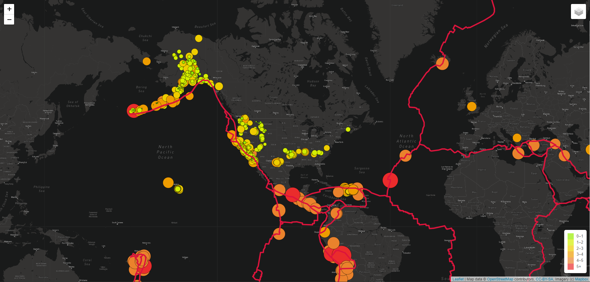

# Mapping_Earthquakes

This purpose of this project is to visualize the earthquake data for past 7 days one a map in relation to the tectonic plates’ location on the earth and to show all the earthquakes with a magnitude greater than 4.5. The webpaage will show the data below: 

